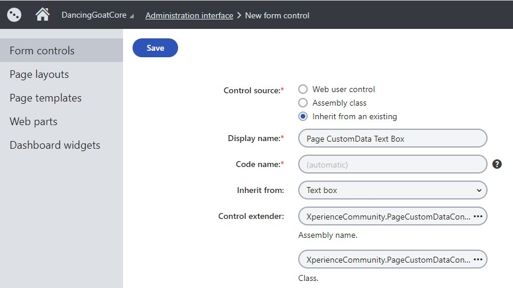

# Xperience Page Navigation Redirects

[](https://www.nuget.org/packages/XperienceCommunity.PageNavigationRedirects)

An ASP.NET Core ResourceFilter that can redirect HTTP requests to other URLs, configurable per Page from the Xperience Administration application.

Watch [video demo](./images/08-redirection-type-selection.mp4) of setting the navigation redirect on a Page.

## Dependencies

This package is compatible with Kentico Xperience 13 ASP.NET Core applications.

This package should be used in combination with the [XperienceCommunity.PageCustomDataControlExtender](https://github.com/wiredviews/xperience-page-custom-data-control-extender)

## How to Use?

1.  Add the [XperienceCommunity.PageCustomDataControlExtender](https://github.com/wiredviews/xperience-page-custom-data-control-extender) NuGet package to the CMSApp administration application

1.  Create inheriting Form Controls for existing Form Controls using the XperienceCommunity.PageCustomDataControlExtender

    

    1. The "Drop-down list" Form Control

       - Used to select the redirect type
       - Use Control for: `Text`
       - Show control in: `Page types`

       

    1. The "Page Selector" Form Control

       - Used for internal redirects
       - Use Control for: `Unique identifier (GUID)`
       - Show control in: `Page types`

       

    1. The "URL Checker" Form Control

       - Used for external redirects
       - Use Control for: `Text`
       - Show control in: `Page types`

       

    1. (optional) The "Text Box" Form Control

       - Used for setting the First Child Class Name
       - Use Control for: `Text`
       - Show control in: `Page types`

       

    1. (optional) The "Three state checkbox" Form Control

       - Used for setting the redirect status code (301 vs 302) per-Page
       - Use Control for: `Integer number`
       - Show control in: `Page types`

       

1.  Install the NuGet package in your Kentico Xperience live site (Content Delivery) ASP.NET Core project

        dotnet add package XperienceCommunity.PageNavigationRedirects

1.  Use the custom Form Controls you created above to create 3 (or 4) new fields on a Page Type you would like to have Navigation Redirection functionality

    **Note**: It's recommended to have a "Base" Page Type (see: '[Inherits fields from pages type](https://docs.xperience.io/developing-websites/defining-website-content-structure/managing-page-types/reference-page-type-properties)') so that the Navigation Redirection only needs configured once and then applies to all navigable Page Types

    

    **Note**: All of these Page Type fields need to be created using the "Field without database representation" Field Type. Since these have no database representation, adding these fields won't impact your database schema and adding them to a "Base" Page Type will only update the `CMS_Class` database table record for the inheriting Page Types.

    

    1.  Redirection Type

        - Field name: `PageRedirectionType`
        - Data type: `Text`
        - Default value: `None`
        - Field caption: `Redirection Type`
        - Form control: `Page CustomData Drop-down list`
        - List of options:

              None,
              Internal,
              External,
              FirstChild;First Child

        - Has depending fields: `true`

    1.  Internal Redirect

        - Field name: `PageInternalRedirectNodeGuid`
        - Data type: `Unique identifier (GUID)`
        - Field caption: `Internal URL`
        - Form control: `Page CustomData Page Selector`
        - Visibility condition: ``
        - Depends on another field: `true`

    1.  External Redirect

        - Field name: `PageExternalRedirectURL`
        - Data type: `Text`
        - Field caption: `External URL`
        - Form control: `Page CustomData URL Checker`
        - Visibility condition: ``
        - Depends on another field: `true`

    1.  First Child Page Type (Optional)

        - Field name: `PageFirstChildClassName`
        - Data type: `Text`
        - Field caption: `First Child Page Type`
        - Form control: `Page CustomData Text box`
        - Visibility condition: ``
        - Depends on another field: `true`

    1.  Permanent Redirect (Optional)

        - Field name: `PageUsePermanentRedirects`
        - Data type: `Integer number`
        - Field caption: `Use Permanent (301) Redirects?`
        - Form control: `Page CustomData Three state check box`
        - Visibility condition: ``
        - Depends on another field: `true`

    **Note**: Any of the field names canbe customized through the `IServiceCollection` extension shown below.

1.  Now create an instance of this Page Type and select the options for navigation redirection that you need

    

1.  Add the `ResourceRedirectFilter` to your ASP.NET Core Mvc configuration:

    ```csharp
    // Example Startup.cs

    public void ConfigureServices(IServiceCollection services)
    {
       services.AddKentico();

       // ...

       services.AddPageNavigationRedirects();
    }
    ```

    Or, if customizing the integration options

    ```csharp
    // Example Startup.cs

    public void ConfigureServices(IServiceCollection services)
    {
       services.AddKentico();

       // ...

       services.AddPageNavigationRedirects(options =>
       {
          options.RedirectionTypeFieldName = "RedirectionType";
          options.UsePermanentRedirect = true;
          options.UseDocumentCustomData = false;

          // ...
       });
    }
    ```

## How Does It Work?

As of Kentico Xperience Refresh 3, the Page Navigation feature from previous non-Mvc versions of the platform has not been added back.

This feature relied on the `CMS_Document` table `DocumentMenuRedirectUrl` column, which meant it was available for _all_ Pages Types, but this column no longer exists.

By using the [XperienceCommunity.PageCustomDataControlExtender](https://github.com/wiredviews/xperience-page-custom-data-control-extender) package, we can store the data for this feature in the `CMS_Document` table `DocumentCustomData` column, making it available for _all_ Page Types.

The three fields we add to the custom Page Type allows us to handle the most common redirection scenarios:

- No redirection
  - Normal behavior in which navigating to the Page's URL alias will load that Page's content
- Internal redirection
  - Content Managers can select another Page in the Content Tree to redirect to. This stores the destination Page's `NodeGUID`, which means the destination Page can be moved around and we'll always redirect to the correct URL
- External redirection
  - Content Managers can enter any valid URL to redirect to
- First Child
  - The first child Page will be the destination for redirection, so that `NodeOrder` of child Pages effectively controls the redirection URL
  - Children can be limited to a specific Page Type via Class Name if there are children of multiple Page Types

All of the redirects can be set to be 301 or 302 globally (global default is 302), and then overridden per-Page.

The Navigation Redirect values can be stored in either `TreeNode.DocumentCustomData` (the default) or `TreeNode.NodeCustomData`, depending on the library's configuration.

An ASP.NET Core [Resource Filter](https://docs.microsoft.com/en-us/aspnet/core/mvc/controllers/filters?view=aspnetcore-5.0#resource-filters) has access to the [PageDataContext](https://docs.xperience.io/developing-websites/implementing-routing/content-tree-based-routing/setting-up-content-tree-based-routing#Settingupcontenttreebasedrouting-Accessingthedataofthecurrentpage) when using [Content Tree based routing](https://docs.xperience.io/developing-websites/implementing-routing/content-tree-based-routing) (custom routing can control redirects programatically). The `PageDataContext` includes the current `TreeNode`, and accessing the Page Navigation Redirection values for the given Page allows the Resource Filter to perform the appropriate redirection.

## References

### ASP.NET Core

- [Resource Filters](https://docs.microsoft.com/en-us/aspnet/core/mvc/controllers/filters?view=aspnetcore-5.0#resource-filters)

### Kentico Xperience

- [Field Editor: Creating New Fields](https://docs.xperience.io/custom-development/extending-the-administration-interface/developing-form-controls/reference-field-editor#ReferenceFieldeditor-Creatingnewfields)
- [Inheriting from existing form controls](https://docs.xperience.io/custom-development/extending-the-administration-interface/developing-form-controls/inheriting-from-existing-form-controls)
- [Defining form control parameters](https://docs.xperience.io/custom-development/extending-the-administration-interface/developing-form-controls/defining-form-control-parameters)
- [XperienceCommunity.PageCustomDataControlExtender](https://github.com/wiredviews/xperience-page-custom-data-control-extender)
- [Accessing the data of the current page](https://docs.xperience.io/developing-websites/implementing-routing/content-tree-based-routing/setting-up-content-tree-based-routing#Settingupcontenttreebasedrouting-Accessingthedataofthecurrentpage)
