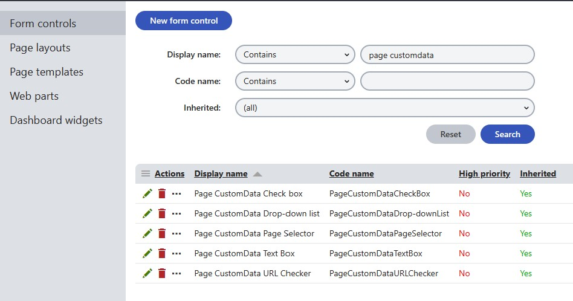
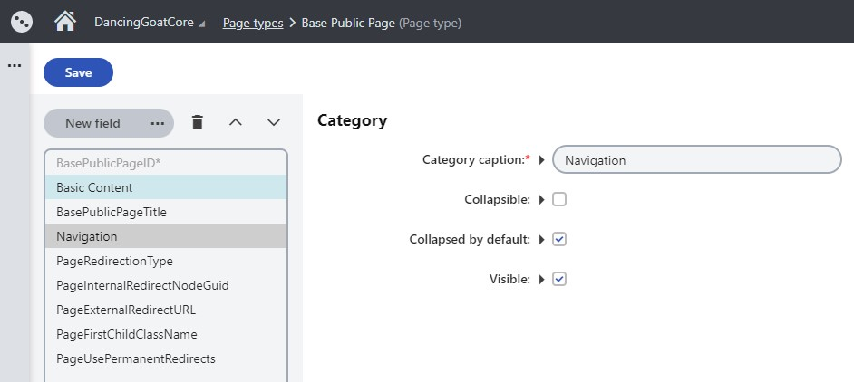

# Xperience Page Navigation Redirects

[](https://www.nuget.org/packages/XperienceCommunity.PageNavigationRedirects)

An ASP.NET Core ResourceFilter that can redirect HTTP requests to other URLs, configurable from the Xperience Administration application

## Dependencies

This package is compatible with Kentico Xperience 13 ASP.NET Core applications.

This package should be used in combination with the [XperienceCommunity.PageCustomDataControlExtender](https://github.com/wiredviews/xperience-page-custom-data-control-extender)

## How to Use?

1. Add the [XperienceCommunity.PageCustomDataControlExtender](https://github.com/wiredviews/xperience-page-custom-data-control-extender) NuGet package to the CMSApp administration application

1. Create inheriting Form Controls for 3 existing Form Controls using the XperienceCommunity.PageCustomDataControlExtender

   

   1. The "Drop-down list" Form Control, which should be assigned the following after creation

      - Use Control for: `Text`
      - Show control in: `Page types`

      

   1. The "Page Selector" Form Control, which should be assigned the following after creation

      - Use Control for: `Unique identifier (GUID)`
      - Show control in: `Page types`

      

   1. The "URL Checker" Form Control, which should be assigned the following after creation

      - Use Control for: `Text`
      - Show control in: `Page types`

      

1. Install the NuGet package in your Kentico Xperience live site (Content Delivery) ASP.NET Core project

   ```bash
   dotnet add package XperienceCommunity.PageNavigationRedirects
   ```

1. Use the custom Form Controls you created above to create 3 new fields on a Page Type you would like to have Navigation Redirection functionality

   **Note**: It's recommended to have a "Base" Page Type (see: '[Inherits fields from pages type](https://docs.xperience.io/developing-websites/defining-website-content-structure/managing-page-types/reference-page-type-properties)') so that the Navigation Redirection only needs configured once and then applies to all navigable Page Types

   

   **Note**: All of these Page Type fields need to be created using the "Field without database representation" Field Type. Since these have no database representation, adding these fields won't impact your database schema and adding them to a "Base" Page Type will only update the `CMS_Class` database table record for the inheriting Page Types.

   1. Redirection Type

      - Field name: `PageRedirectionType`
      - Data type: `Text`
      - Default value: `None`
      - Field caption: `Redirection Type`
      - Form control: `Page CustomData Drop-down list`
      - List of options:

      ```bash
      None,
      Internal,
      External,
      FirstChild;First Child
      ```

      - Has depending fields: `true`

   1. Internal Redirect

      - Field name: `PageInternalRedirectNodeGuid`
      - Data type: `Unique identifier (GUID)`
      - Field caption: `Internal URL`
      - Form control: `Page CustomData Page Selector`
      - Visibility condition: ``
      - Depends on another field: `true`

   1. External Redirect

      - Field name: `PageExternalRedirectURL`
      - Data type: `Text`
      - Field caption: `External URL`
      - Form control: `Page CustomData URL Checker`
      - Visibility condition: ``
      - Depends on another field: `true`

   

1. Now create an instance of this Page Type and select the options for navigation that you need

   

1. Add the `ResourceRedirectFilter` to your ASP.NET Core Mvc configuration:

   ```csharp
   // Example Startup.cs

   public void ConfigureServices(IServiceCollection services)
   {
      services.AddKentico();

      // ...

      services.AddControllersWithViews(options =>
      {
         options.Filters.Add(typeof(RedirectResourceFilter));
      });
   }
   ```

## How Does It Work?

## References

### Kentico Xperience

- [Field Editor: Creating New Fields](https://docs.xperience.io/custom-development/extending-the-administration-interface/developing-form-controls/reference-field-editor#ReferenceFieldeditor-Creatingnewfields)
- [Inheriting from existing form controls](https://docs.xperience.io/custom-development/extending-the-administration-interface/developing-form-controls/inheriting-from-existing-form-controls)
- [Defining form control parameters](https://docs.xperience.io/custom-development/extending-the-administration-interface/developing-form-controls/defining-form-control-parameters)
- [XperienceCommunity.PageCustomDataControlExtender](https://github.com/wiredviews/xperience-page-custom-data-control-extender)

```

```
